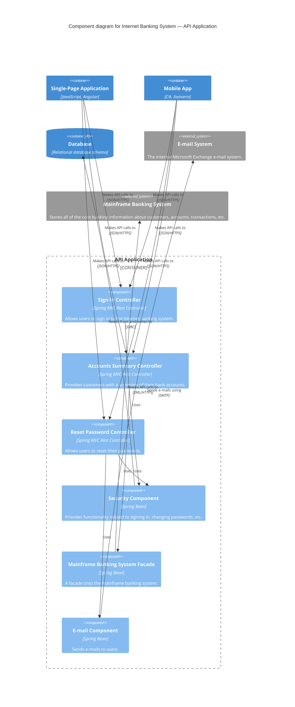

# Component — example

Scope: zoom into the "API Application" container. Show the components that live inside.

From *Visualising Software Architecture*, chapter 8.

## The modelling

### Components (in `Container_Boundary: API Application`)

| Component | Technology | Responsibility |
|---|---|---|
| Sign In Controller | Spring MVC Rest Controller | Allows users to sign in to the Internet banking system. |
| Accounts Summary Controller | Spring MVC Rest Controller | Provides customers with a summary of their bank accounts. |
| Reset Password Controller | Spring MVC Rest Controller | Allows users to reset their passwords. |
| Security Component | Spring Bean | Provides functionality related to signing in, changing passwords, etc. |
| Mainframe Banking System Facade | Spring Bean | A facade onto the mainframe banking system. |
| E-mail Component | Spring Bean | Sends e-mails to users. |

### Surrounding (simplified, for context)

Single-Page App (Container) • Mobile App (Container) • Database (Container) • E-mail System (System_Ext) • Mainframe Banking System (System_Ext)

### Relationships

| From | To | Description | Protocol |
|---|---|---|---|
| SPA | Sign In Controller | Makes API calls to | JSON/HTTPS |
| SPA | Accounts Summary Controller | Makes API calls to | JSON/HTTPS |
| SPA | Reset Password Controller | Makes API calls to | JSON/HTTPS |
| Mobile App | Sign In Controller | Makes API calls to | JSON/HTTPS |
| Mobile App | Accounts Summary Controller | Makes API calls to | JSON/HTTPS |
| Mobile App | Reset Password Controller | Makes API calls to | JSON/HTTPS |
| Sign In Controller | Security Component | Uses | — (in-process) |
| Reset Password Controller | Security Component | Uses | — |
| Reset Password Controller | E-mail Component | Uses | — |
| Accounts Summary Controller | Mainframe Banking System Facade | Uses | — |
| Security Component | Database | Reads from and writes to | JDBC |
| Mainframe Banking System Facade | Mainframe | Makes API calls to | XML/HTTPS |
| E-mail Component | E-mail System | Sends e-mails using | SMTP |

Intra-container calls (component-to-component) don't need a protocol — they're method calls in the same process.

## Mermaid rendering

## Notes

- This is the Component diagram most teams *shouldn't* maintain forever. It's more volatile than the Container diagram — one refactor can invalidate it. Draw it when you need it (onboarding, design session); accept it will age.
- Controllers vs Beans reflect a layered architecture. For a hexagonal / ports-and-adapters container, you'd show ports and adapters instead. The Component diagram should reflect the *actual* architectural style of the container.
