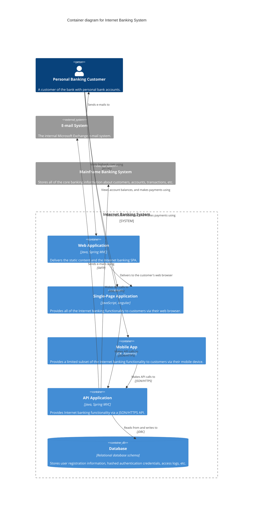

# Container — example

Scope: zoom into the Internet Banking System. Five containers: a server-rendered Web Application, an SPA, a Mobile App, an API backend, and a Database. The surrounding people and external systems are repeated from the Context diagram.

From *Visualising Software Architecture*, chapter 7.

## The modelling

### Containers (in `System_Boundary: Internet Banking System`)

| Container | Technology | Responsibility |
|---|---|---|
| Web Application | Java, Spring MVC | Delivers the static content and the Internet banking SPA. |
| Single-Page Application | JavaScript, Angular | Provides all of the Internet banking functionality to customers via their web browser. |
| Mobile App | C#, Xamarin | Provides a limited subset of the Internet banking functionality to customers via their mobile device. |
| API Application | Java, Spring MVC | Provides Internet banking functionality via a JSON/HTTPS API. |
| Database | Relational schema | Stores user registration information, hashed authentication credentials, access logs, etc. |

### Surrounding (repeated from Context diagram)

Personal Banking Customer (Person) • E-mail System (System_Ext) • Mainframe Banking System (System_Ext)

### Relationships (every line has a protocol)

| From | To | Description | Protocol |
|---|---|---|---|
| Customer | Web Application | Visits bigbank.com using | HTTPS |
| Customer | Single-Page App | Views account balances, and makes payments using | — |
| Customer | Mobile App | Views account balances, and makes payments using | — |
| Web Application | Single-Page App | Delivers to the customer's web browser | — |
| Single-Page App | API Application | Makes API calls to | JSON/HTTPS |
| Mobile App | API Application | Makes API calls to | JSON/HTTPS |
| API Application | Database | Reads from and writes to | JDBC |
| API Application | E-mail System | Sends e-mails using | SMTP |
| API Application | Mainframe Banking System | Makes API calls to | XML/HTTPS |
| E-mail System | Customer | Sends e-mails to | — |

## Mermaid rendering

## Why this one is hard to get wrong

- The `System_Boundary` makes the scope obvious.
- Technology is on every container and every protocol is on every inter-container line.
- The Customer, E-mail System, and Mainframe are repeated from the Context diagram with the same names — continuity.
- "Visits … using HTTPS" reads as a sentence; so does "Reads from and writes to / JDBC".
