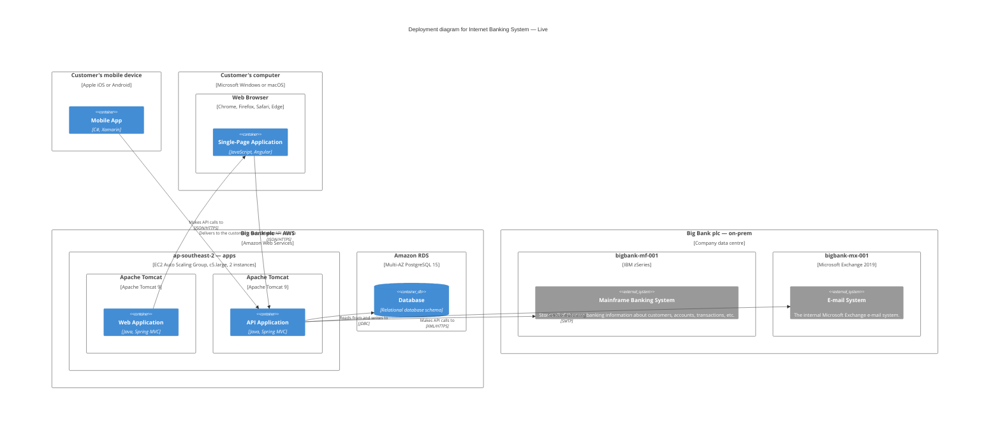

# Deployment — example

Scope: map the Internet Banking System containers onto live infrastructure. An on-prem data centre for the mainframe / mail / DB, an AWS account for the web tier, and the customer's mobile device or browser.

From *Visualising Software Architecture*, chapter 11.

## The modelling

### Deployment nodes (nested)

- **Customer's mobile device** (Apple iOS or Android)
  - Mobile App container
- **Customer's computer** (Windows or macOS)
  - **Web Browser** (Chrome / Firefox / Safari / Edge)
    - Single-Page Application container
- **Big Bank plc — AWS** (Amazon Web Services)
  - **ap-southeast-2 — apps** (EC2 Auto Scaling Group, c5.large, 2 instances)
    - **Apache Tomcat** (Apache Tomcat 9) — Web Application
    - **Apache Tomcat** (Apache Tomcat 9) — API Application
  - **Amazon RDS** (Multi-AZ PostgreSQL 15)
    - Database container
- **Big Bank plc — on-prem** (Company data centre)
  - **bigbank-mf-001** (IBM zSeries) — Mainframe Banking System (external)
  - **bigbank-mx-001** (Microsoft Exchange 2019) — E-mail System (external)

### Relationships (real-world network edges)

- Mobile App → API Application — JSON/HTTPS
- SPA → API Application — JSON/HTTPS
- Web Application → SPA (delivery)
- API Application → Database — JDBC
- API Application → E-mail System — SMTP
- API Application → Mainframe — XML/HTTPS

## Mermaid rendering

## Notes

- **One deployment diagram per environment.** The Dev diagram will show Docker containers on a developer laptop; the Live diagram shows AWS + on-prem. Don't try to combine them.
- **Cloud architecture diagrams are deployment diagrams.** If you're drawing a "cloud diagram" for AWS / Azure / GCP, this is the format — deployment nodes with your containers *inside* them. A diagram that just lists AWS services without showing what they run is half a picture. Feel free to use the provider's icon set on the deployment nodes — just add them to the legend.
- **External systems (Mainframe, E-mail)** can appear inside deployment nodes on a Deployment diagram even if you don't own the node itself, to show where they physically live.
- For deployment diagrams with heavy nesting, Mermaid's layout can struggle. Consider PlantUML C4 or Structurizr DSL if layout quality matters.
