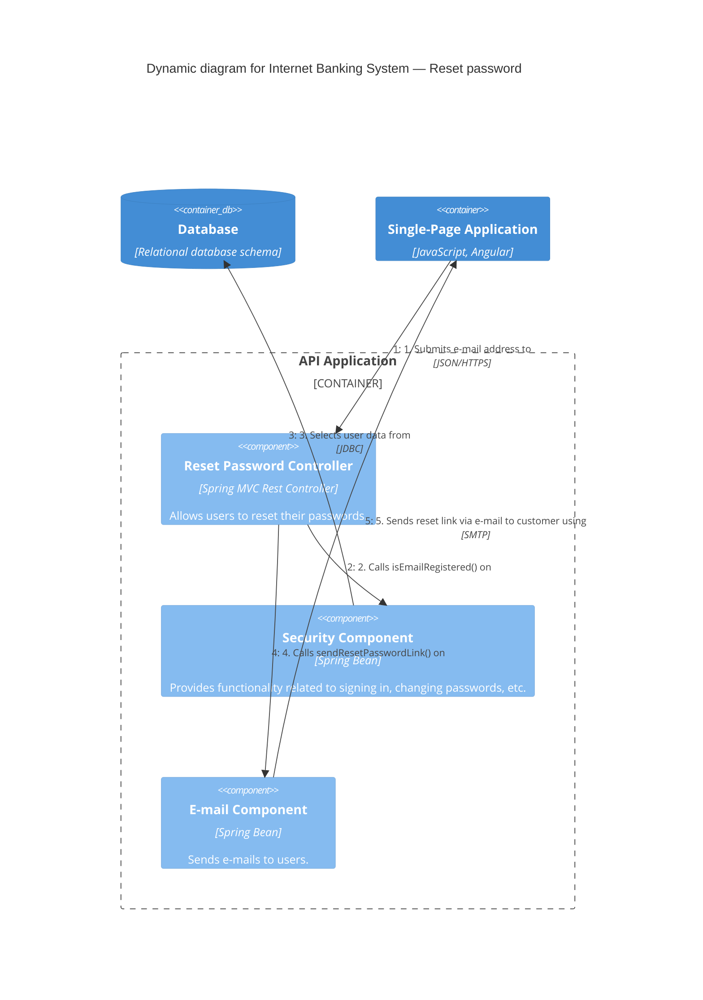

# Dynamic — example

Scope: runtime view of one feature — a customer resetting their password. Numbered interactions. One abstraction level (components inside the API Application, with surrounding containers for context).

From *Visualising Software Architecture*, chapter 10.

## The modelling

### Participants

- Single-Page App (Container) — the customer's browser-side SPA.
- API Application (Container_Boundary) containing:
  - Reset Password Controller (Component)
  - Security Component (Component)
  - E-mail Component (Component)
- Database (Container, ContainerDb)

### Numbered flow

1. SPA → Reset Password Controller: submits email address  [JSON/HTTPS]
2. Reset Password Controller → Security Component: calls `isEmailRegistered()`
3. Security Component → Database: SELECT user data  [JDBC]
4. Reset Password Controller → E-mail Component: calls `sendResetPasswordLink()`
5. E-mail Component → SPA (via the customer): sends reset link via e-mail  [SMTP]

(The arrow from E-mail Component back to SPA is a simplification — in reality it goes via the E-mail System and the customer's mailbox. If the flow were more important at the inter-container level, the diagram would zoom out.)

## Mermaid rendering

## Notes

- Dynamic diagrams are for **one specific flow**. An app with 100 features doesn't need 100 dynamic diagrams — draw them for critical or recurring patterns only.
- You can also draw Dynamic diagrams at other abstraction levels (Systems, Containers, Code), but pick one level and stay on it. Mixing container and component interactions on the same diagram breaks the abstraction.
- An alternative to this "numbered Rel labels" style is a classic UML **sequence diagram**. Mermaid supports those too via `sequenceDiagram` — see the `mermaid` skill's `references/sequence.md`. Both styles convey the same information; pick whichever your audience reads better.
