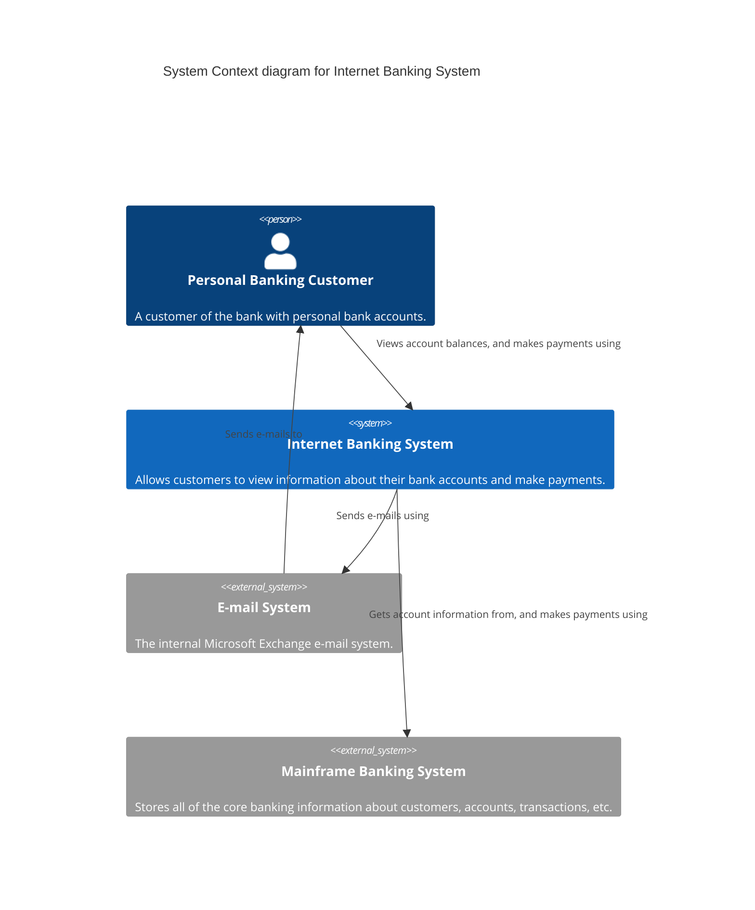

# System Context — example

Scope: one bank customer, one system in focus (Internet Banking System), two external systems.

From *Visualising Software Architecture*, chapter 6.

## The modelling (the C4 part)

| Element | Type | Description |
|---|---|---|
| Personal Banking Customer | Person | A customer of the bank with personal bank accounts. |
| Internet Banking System | Software System (in focus) | Allows customers to view information about their bank accounts and make payments. |
| E-mail System | Software System (external) | The internal Microsoft Exchange e-mail system. |
| Mainframe Banking System | Software System (external) | Stores all of the core banking information about customers, accounts, transactions, etc. |

| From | To | Description |
|---|---|---|
| Personal Banking Customer | Internet Banking System | Views account balances, and makes payments using |
| Internet Banking System | E-mail System | Sends e-mails using |
| Internet Banking System | Mainframe Banking System | Gets account information from, and makes payments using |
| E-mail System | Personal Banking Customer | Sends e-mails to |

No technology detail, no protocols, no internal structure. This is all a non-technical stakeholder needs to understand the scope.

## Mermaid rendering

For the same model in Structurizr DSL, PlantUML C4, or other formats, see `../../references/output-formats.md`.
