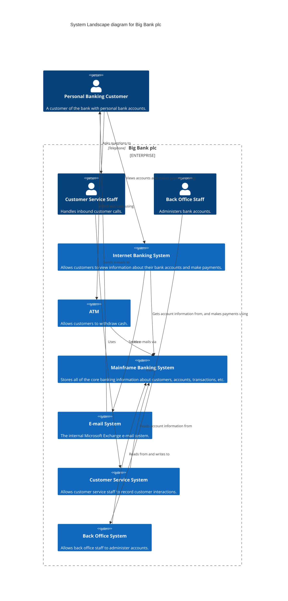

# System Landscape — example

Scope: widen the lens beyond a single system. Show the software systems across an organisation (or a department, product domain, or business capability) and who uses them.

From *Visualising Software Architecture*, chapter 12.

## The modelling

A landscape diagram is a Context diagram *without one system in focus*. It's useful when you're answering:

- How do the systems in this group/department/domain fit together?
- What is the impact of change if a system is added, removed, restructured?
- What is the impact of org change (merger, team split)?

### People

- **Personal Banking Customer** — views accounts and makes payments; outside the bank.
- **Customer Service Staff** — handles inbound customer calls; inside the bank.
- **Back Office Staff** — administers accounts; inside the bank.

### Software systems (inside the `Big Bank plc` boundary)

- **Internet Banking System** — customer-facing web banking.
- **ATM** — customer-facing cash machines.
- **Mainframe Banking System** — core banking.
- **E-mail System** — internal Microsoft Exchange.
- **Customer Service System** — CRM / call handling.
- **Back Office System** — account administration.

### Relationships

- Personal Banking Customer → Internet Banking System — views accounts, makes payments
- Personal Banking Customer → ATM — withdraws cash
- Personal Banking Customer → Customer Service Staff — phones to ask questions
- Internet Banking System → Mainframe Banking System — reads/writes account data
- ATM → Mainframe Banking System — reads/writes account data
- Customer Service Staff → Customer Service System — uses
- Customer Service System → Mainframe Banking System — reads account data
- Back Office Staff → Back Office System — uses
- Back Office System → Mainframe Banking System — reads/writes account data
- Internet Banking System → E-mail System — sends notifications via
- E-mail System → Personal Banking Customer — delivers e-mails to

## Mermaid rendering

Mermaid's C4 doesn't have a dedicated Landscape header — use `C4Context` and an `Enterprise_Boundary` for the organisational boundary.

## Notes

- The **enterprise / organisational boundary** (here `Enterprise_Boundary`) is conventionally drawn as a dotted box. Customers are outside; internal people and systems are inside.
- This is the bridge into **enterprise architecture** without requiring a full EA model. Many orgs have no such overview despite being dependent on many systems — even a rough landscape diagram is valuable.
- You can **overlay** extra info: system ownership, data ownership, vendor vs in-house, retirement status, risk level. Put each encoding in the legend. Don't over-do it — a landscape diagram is already dense.
- **Inside the boundary, landscape diagrams drop to System level.** If you find yourself wanting to show containers, you're drawing the wrong kind of diagram — drop one level and make a Container diagram for one system.
