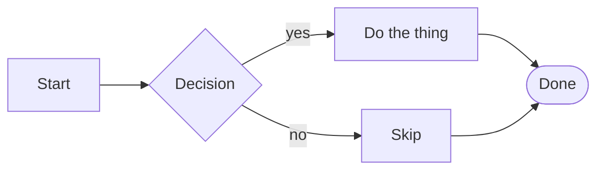
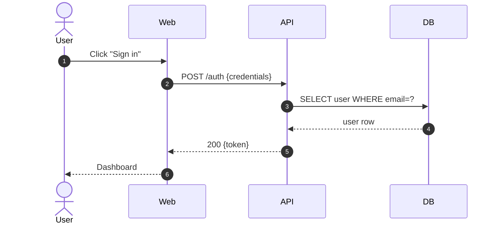
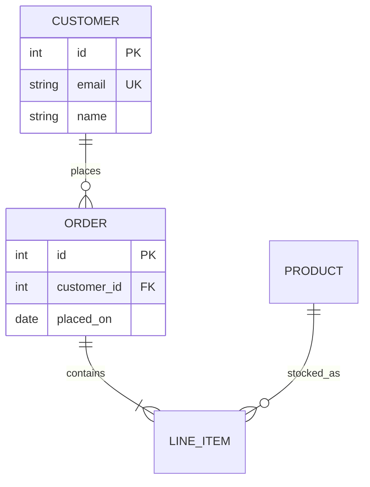

# Mermaid diagrams

Turn a description into a Mermaid diagram, validated against the syntax Mermaid actually accepts, and delivered as a fenced ` ```mermaid ` block ready to drop into Markdown. The output is text the user can commit to a repo, paste into a PR description, or render with any Mermaid-capable tool.

## Workflow

1. **Pick the diagram type** from the chooser below. If the request fits multiple, ask the user or pick the simplest one that answers their question.
2. **Load the reference** for that type from `references/` before writing syntax. Do not write Mermaid from memory — the grammar is fussy, varies between diagram types, and has changed across versions.
3. **Write the diagram** using the smallest fenced block that answers the question. Keep it legible: fewer nodes, shorter labels, aligned structure.
4. **Self-validate** against `references/validation.md` (common errors, reserved words, quoting rules, version gates). Dry-run with `mmdc` if the user is in an environment that can execute it.
5. **Deliver as Markdown.** Wrap the diagram in ` ```mermaid ` fences. If the user is authoring a doc, show where it goes; if they're pasting into GitHub/GitLab/MkDocs/Docusaurus, `references/markdown-rendering.md` covers the quirks.

## Diagram chooser

| User's need | Diagram | Header | Reference |
|---|---|---|---|
| Process with decisions / control flow | Flowchart | `flowchart TD` / `graph LR` | `references/flowchart.md` |
| Interaction between actors/services over time | Sequence | `sequenceDiagram` | `references/sequence.md` |
| OO class structure, methods, inheritance | Class | `classDiagram` | `references/class.md` |
| State machine / lifecycle | State | `stateDiagram-v2` | `references/state.md` |
| Database / domain entity relationships | ERD | `erDiagram` | `references/er.md` |
| Software architecture, system boundaries | C4 (in Mermaid) | `C4Context` / `C4Container` / `C4Component` / `C4Dynamic` / `C4Deployment` | `references/c4.md` — and use the dedicated `c4` skill for *designing* the diagram |
| Cloud / infra topology with icons | Architecture | `architecture-beta` | `references/architecture.md` |
| Project schedule with dates/deps | Gantt | `gantt` | `references/project-diagrams.md` |
| Kanban board snapshot | Kanban | `kanban` | `references/project-diagrams.md` |
| Event chronology | Timeline | `timeline` | `references/project-diagrams.md` |
| User experience steps with satisfaction scores | User journey | `journey` | `references/project-diagrams.md` |
| Proportions of a whole | Pie | `pie` | `references/data-diagrams.md` |
| 2×2 prioritisation matrix | Quadrant | `quadrantChart` | `references/data-diagrams.md` |
| Line/bar chart | XY Chart | `xychart-beta` | `references/data-diagrams.md` |
| Flow volumes between nodes | Sankey | `sankey-beta` | `references/data-diagrams.md` |
| Multi-dim comparison | Radar | `radar-beta` | `references/data-diagrams.md` |
| Block layout (columns-based) | Block | `block-beta` | `references/other-diagrams.md` |
| Network packet fields | Packet | `packet-beta` | `references/other-diagrams.md` |
| Hierarchical idea tree | Mindmap | `mindmap` | `references/other-diagrams.md` |
| Formal requirement traceability | Requirement | `requirementDiagram` | `references/other-diagrams.md` |
| Git branch/commit history | GitGraph | `gitGraph` | `references/other-diagrams.md` |

If the user asks for a "diagram" and the intent is architectural (containers, services, people, data stores), default to C4 — and route to the `c4` skill for the *modelling* work; come back here only for the Mermaid rendering.

## Quickstart — the three most common

Verified, copy-ready minima. Expand from these; don't invent shape sigils from scratch.

**Flowchart**


**Sequence**


**ER diagram**


## Shared syntax (applies to every diagram)

- **Fence with language tag**: ` ```mermaid ` — GitHub, GitLab, MkDocs+`mermaid2`, Docusaurus (`@docusaurus/theme-mermaid`), and Obsidian all render on this marker.
- **Frontmatter config (preferred over `%%{init}%%`)** — directives are deprecated as of v10.5.0:
  ```
  ---
  title: My Diagram
  config:
    theme: forest
    flowchart:
      curve: stepBefore
  ---
  flowchart LR
      …
  ```
- **Themes**: `default`, `base`, `dark`, `forest`, `neutral`. Only `base` accepts `themeVariables` customisation; colours must be hex (`#ff0000`), not names.
- **Comments**: `%% comment`. Ignored by the parser.
- **Quote labels with special characters**: any label containing `,`, `:`, `(`, `"`, or `#` should be wrapped in double quotes. Escape literal quotes as `&quot;`, `#` as `&#35;`, `;` as `&#59;`.
- **Reserved words**: avoid using bare `end`, `subgraph`, `class`, `style`, `state`, `note`, `link`, `click`, etc. as node IDs or labels. Where you must, capitalise or quote (`"End"`).
- **Line breaks in labels**: `\n` inside a quoted label, or `<br>` in most diagrams; markdown-style wrapping inside backticks for some diagrams.

See `references/core-syntax.md` for the complete shared grammar (frontmatter, theming, config, escaping, accessibility).

## Validation

Do not hand back a diagram you haven't sanity-checked. `references/validation.md` covers:

- The reserved-word gotchas that silently break renders.
- Diagram-type-specific traps (e.g. `flowchart` vs deprecated `graph`, `stateDiagram-v2` vs `stateDiagram`, `sequenceDiagram` needs `participant` before free-form actor mentions to get order right).
- How to render-check with `mmdc` (`@mermaid-js/mermaid-cli`): `mmdc -i diagram.mmd -o /tmp/out.svg` returns a non-zero exit and a parser error on failure — the cheapest way to be sure.
- What GitHub's renderer supports vs. what the upstream parser supports (lag is usually 1-2 minor versions; `-beta` diagrams may not render there yet).

**Quick check before returning a diagram:**

- Headers: exact keyword on its own line (no trailing punctuation, correct case).
- Every arrow connects two declared nodes/participants.
- Every label with `{ } [ ] ( )` or punctuation is quoted.
- No stray tabs; Mermaid is whitespace-sensitive in mindmap / indented diagrams.
- `-beta` and `-v2` suffixes only where the feature actually requires them.

## Markdown output targets

The same fenced block renders differently across ecosystems. `references/markdown-rendering.md` details:

- **GitHub / GitLab**: native support; no setup.
- **MkDocs Material**: needs `pymdownx.superfences` + `mermaid2` plugin, or the `custom_fences` superfences config.
- **Docusaurus**: enable `markdown.mermaid: true` and install `@docusaurus/theme-mermaid`.
- **Obsidian**: native, but older plugins may hold an outdated Mermaid version.
- **Notion**: paste as a code block with language = Mermaid (UI selector).
- **Confluence Cloud**: Atlassian's native code block does *not* render Mermaid; use the "Mermaid Diagrams" marketplace macro or pre-render with `mmdc` and paste SVG/PNG.
- **Static SVG/PNG export**: `mmdc -i diagram.mmd -o diagram.svg` (install: `npm i -g @mermaid-js/mermaid-cli`).

## Anti-patterns to avoid

- **No fence language tag**: ` ``` ` alone will be shown as plain text. Always ` ```mermaid `.
- **Quoting shape sigils inside quotes**: `A["[Text]"]` is usually wrong — once quoted, the brackets inside become literal text, not the shape. Pick `A["Text"]` with the shape chosen by the outer brackets.
- **Mixing diagram types in one block**: you can't put a `sequenceDiagram` message inside a `flowchart`. One header, one diagram.
- **Relying on layout tweaks that don't exist in the chosen diagram**: e.g. C4 in Mermaid has no `Lay_U/D/L/R`; flowchart has no native vertical-within-subgraph override when the parent has a different direction.
- **Over-styling**: `style`/`classDef` on every node produces an unreadable rainbow. Use styling to emphasise, not to decorate.
- **Huge diagrams**: Mermaid renders them, but nobody reads them. Over ~30 nodes, split into multiple diagrams or switch to a different tool.

## References

Load the reference for the diagram type you are rendering before writing syntax:

- `references/core-syntax.md` — frontmatter, config, theming, escaping, comments, accessibility
- `references/flowchart.md` — shapes (legacy and v11.3+ `@{ shape: }`), arrows, subgraphs, styling, click, icons, animations
- `references/sequence.md` — participants/actors, arrows (including async `-)` and half-arrows), notes, alt/loop/par/critical/break, activations, autonumber, create/destroy
- `references/class.md` — classes, visibility (`+ - # ~`), generics, relationships (`<|-- *-- o-- --> ..> ..|>`), cardinality, namespaces, notes
- `references/state.md` — `stateDiagram-v2`, composite states, choice/fork/join, concurrency via `--`, notes
- `references/er.md` — entities, attributes with PK/FK/UK, cardinality glyphs (`|o ||  }o }|`), identifying vs non-identifying
- `references/c4.md` — Mermaid's C4 dialect (element fns, `Rel*`, `System_Boundary`, `UpdateRelStyle`, limitations vs PlantUML C4)
- `references/architecture.md` — `architecture-beta`, groups, services, junctions, directional edge anchors
- `references/project-diagrams.md` — gantt, kanban, timeline, journey
- `references/data-diagrams.md` — pie, quadrantChart, xychart-beta, sankey-beta, radar-beta
- `references/other-diagrams.md` — block-beta, packet-beta, mindmap, requirementDiagram, gitGraph
- `references/validation.md` — error catalog, `mmdc` validation, version gates, GitHub renderer limits
- `references/markdown-rendering.md` — ecosystem-specific embedding (GitHub, GitLab, MkDocs, Docusaurus, Obsidian, Notion, Confluence)

Ready-made starter blocks for every diagram type live in `assets/examples/`.
