# Mermaid starter blocks

Copy-ready minima for every diagram type. Edit these in place; don't synthesise from memory.

---

## Flowchart

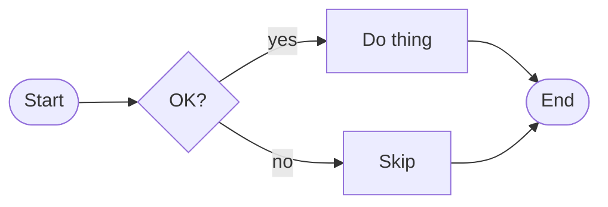
```mermaid
flowchart LR
    Start([Start]) --> Check{OK?}
    Check -- yes --> Do[Do thing]
    Check -- no --> Skip[Skip]
    Do --> End([End])
    Skip --> End
```

## Sequence

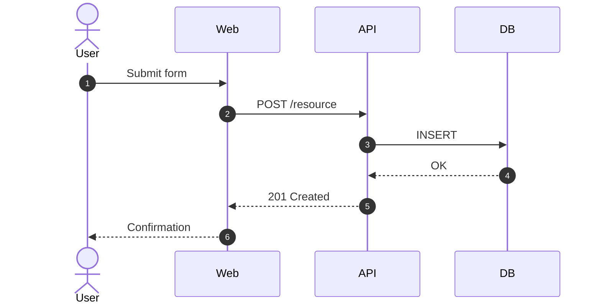
```mermaid
sequenceDiagram
    autonumber
    actor User
    participant Web
    participant API
    participant DB
    User->>Web: Submit form
    Web->>API: POST /resource
    API->>DB: INSERT
    DB-->>API: OK
    API-->>Web: 201 Created
    Web-->>User: Confirmation
```

## Class

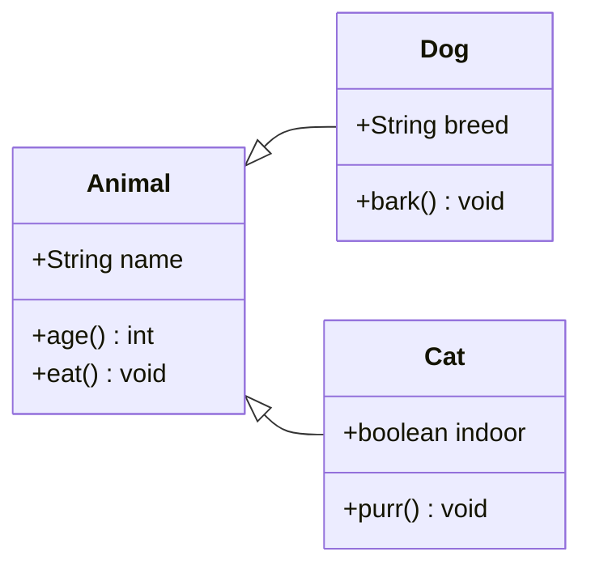
```mermaid
classDiagram
    direction LR
    class Animal {
        +String name
        +age() int
        +eat() void
    }
    class Dog {
        +String breed
        +bark() void
    }
    class Cat {
        +boolean indoor
        +purr() void
    }
    Animal <|-- Dog
    Animal <|-- Cat
```

## State

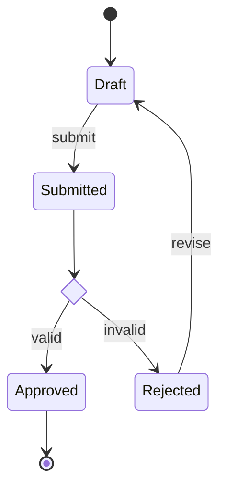
```mermaid
stateDiagram-v2
    [*] --> Draft
    Draft --> Submitted : submit
    state if_valid <<choice>>
    Submitted --> if_valid
    if_valid --> Approved : valid
    if_valid --> Rejected : invalid
    Approved --> [*]
    Rejected --> Draft : revise
```

## ERD

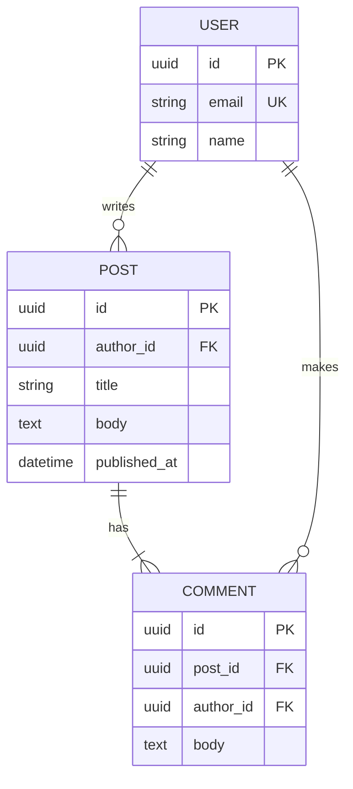
```mermaid
erDiagram
    USER ||--o{ POST : writes
    POST ||--|{ COMMENT : has
    USER ||--o{ COMMENT : makes
    USER {
        uuid id PK
        string email UK
        string name
    }
    POST {
        uuid id PK
        uuid author_id FK
        string title
        text body
        datetime published_at
    }
    COMMENT {
        uuid id PK
        uuid post_id FK
        uuid author_id FK
        text body
    }
```

## C4 (Container)

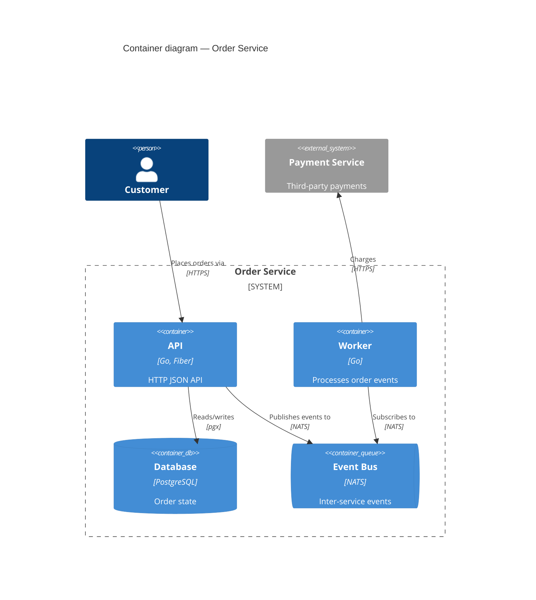
```mermaid
C4Container
    title Container diagram — Order Service

    Person(customer, "Customer")

    System_Boundary(order, "Order Service") {
        Container(api, "API", "Go, Fiber", "HTTP JSON API")
        Container(worker, "Worker", "Go", "Processes order events")
        ContainerDb(db, "Database", "PostgreSQL", "Order state")
        ContainerQueue(queue, "Event Bus", "NATS", "Inter-service events")
    }

    System_Ext(payment, "Payment Service", "Third-party payments")

    Rel(customer, api, "Places orders via", "HTTPS")
    Rel(api, db, "Reads/writes", "pgx")
    Rel(api, queue, "Publishes events to", "NATS")
    Rel(worker, queue, "Subscribes to", "NATS")
    Rel(worker, payment, "Charges", "HTTPS")
```

## Architecture

```mermaid
architecture-beta
    group aws(cloud)[AWS]
    group vpc(cloud)[VPC] in aws

    service alb("logos:aws-elb")[ALB] in vpc
    service api(server)[API] in vpc
    service db(database)[Postgres RDS] in vpc
    service cache(database)[Redis] in vpc
    service s3(disk)[Uploads] in aws
    service lambda("logos:aws-lambda")[Worker] in aws

    alb:B --> T:api
    api:R --> L:db
    api:B --> T:cache
    api:R --> L:s3
    api:B --> T:lambda
    lambda:L --> R:db
```

## Gantt

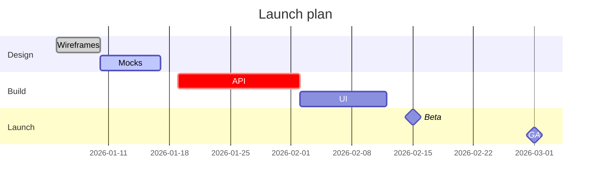
```mermaid
gantt
    title Launch plan
    dateFormat YYYY-MM-DD
    section Design
        Wireframes : done, d1, 2026-01-05, 5d
        Mocks : active, d2, after d1, 7d
    section Build
        API : crit, b1, 2026-01-19, 14d
        UI : f1, after b1, 10d
    section Launch
        Beta : milestone, 2026-02-15, 0d
        GA : milestone, 2026-03-01, 0d
```

## Kanban

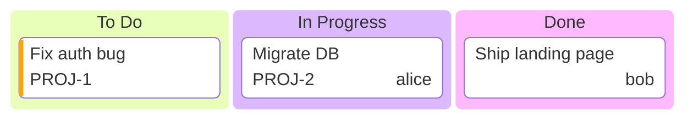
```mermaid
kanban
    todo[To Do]
        t1[Fix auth bug]@{ ticket: "PROJ-1", priority: "High" }
    wip[In Progress]
        t2[Migrate DB]@{ assigned: "alice", ticket: "PROJ-2" }
    done[Done]
        t3[Ship landing page]@{ assigned: "bob" }
```

## Timeline

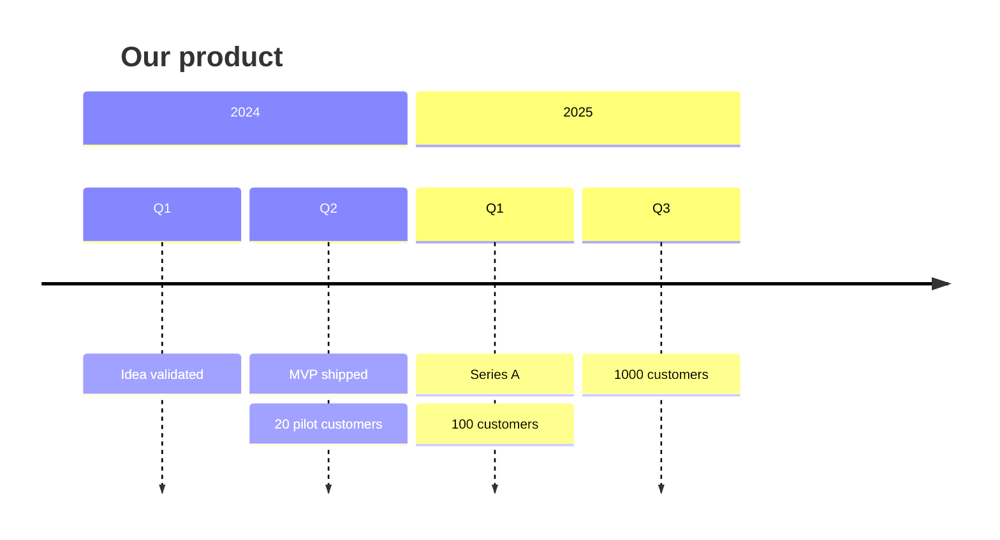
```mermaid
timeline
    title Our product
    section 2024
        Q1 : Idea validated
        Q2 : MVP shipped : 20 pilot customers
    section 2025
        Q1 : Series A : 100 customers
        Q3 : 1000 customers
```

## User Journey

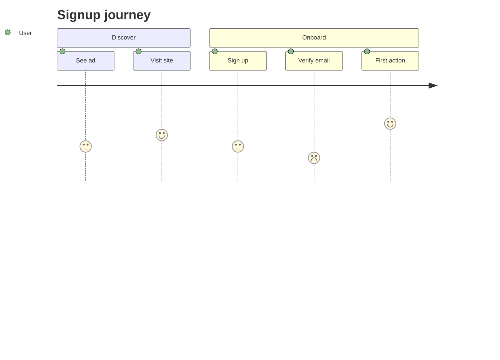
```mermaid
journey
    title Signup journey
    section Discover
        See ad: 3: User
        Visit site: 4: User
    section Onboard
        Sign up: 3: User
        Verify email: 2: User
        First action: 5: User
```

## Pie

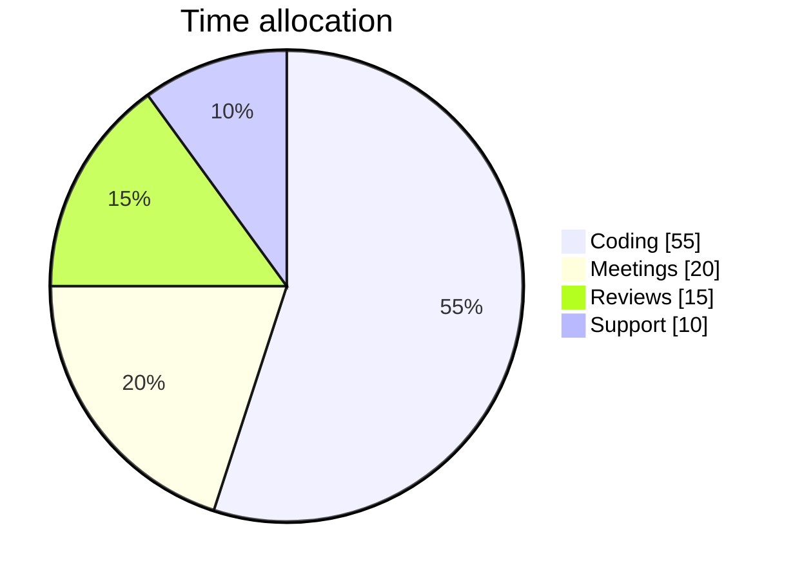
```mermaid
pie showData
    title Time allocation
    "Coding" : 55
    "Meetings" : 20
    "Reviews" : 15
    "Support" : 10
```

## Quadrant

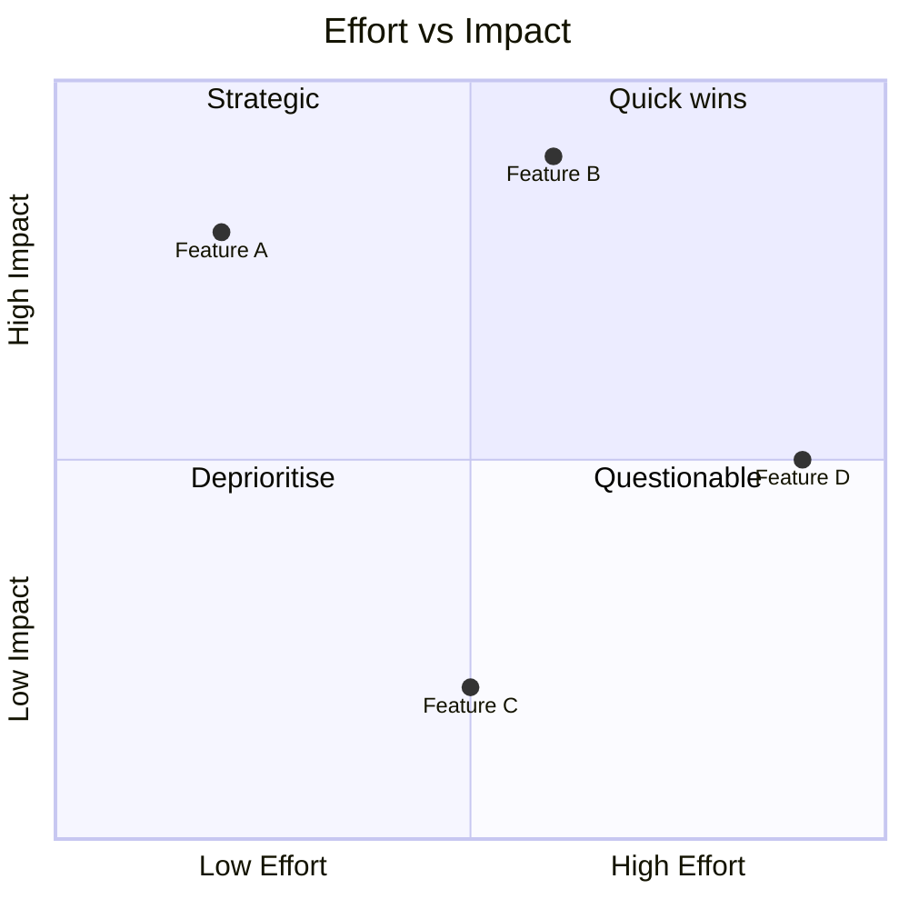
```mermaid
quadrantChart
    title Effort vs Impact
    x-axis Low Effort --> High Effort
    y-axis Low Impact --> High Impact
    quadrant-1 Quick wins
    quadrant-2 Strategic
    quadrant-3 Deprioritise
    quadrant-4 Questionable
    Feature A: [0.2, 0.8]
    Feature B: [0.6, 0.9]
    Feature C: [0.5, 0.2]
    Feature D: [0.9, 0.5]
```

## XY Chart

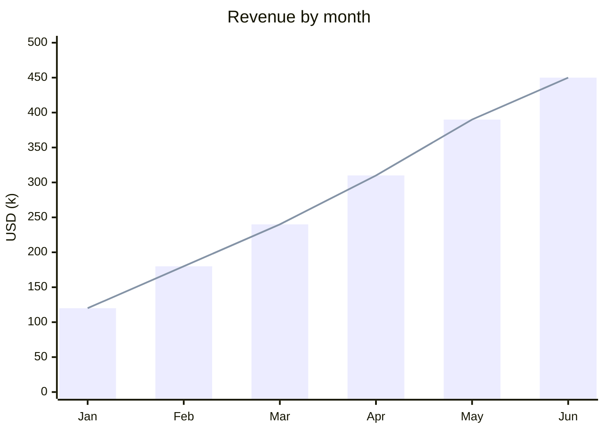
```mermaid
xychart-beta
    title "Revenue by month"
    x-axis [Jan, Feb, Mar, Apr, May, Jun]
    y-axis "USD (k)" 0 --> 500
    bar [120, 180, 240, 310, 390, 450]
    line [120, 180, 240, 310, 390, 450]
```

## Sankey

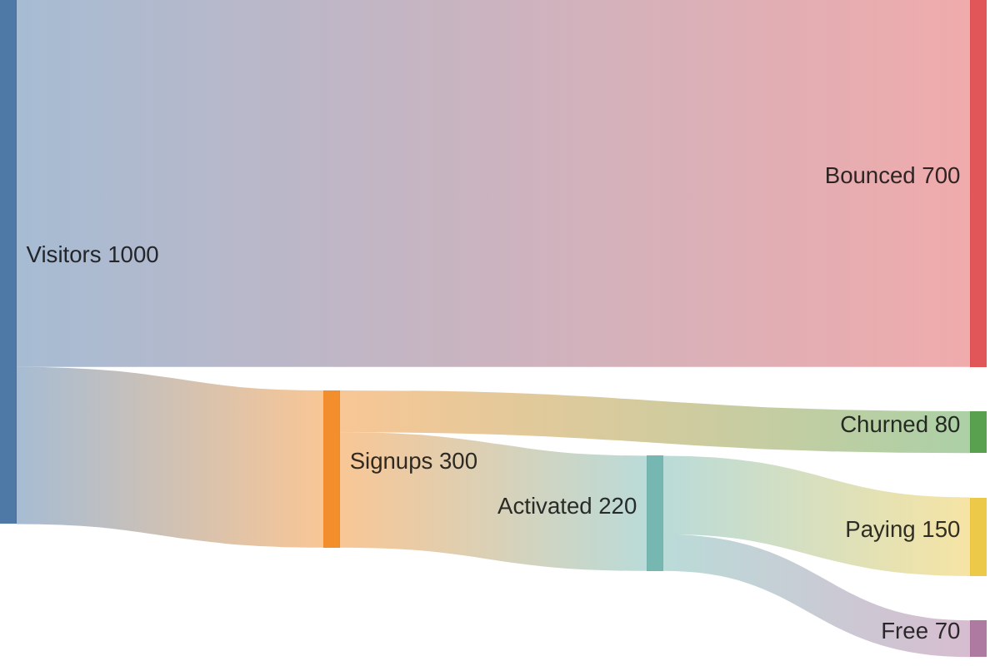
```mermaid
sankey-beta

Visitors,Signups,300
Visitors,Bounced,700
Signups,Activated,220
Signups,Churned,80
Activated,Paying,150
Activated,Free,70
```

## Radar

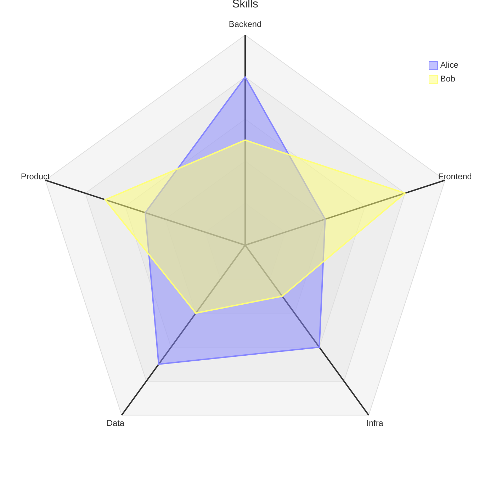
```mermaid
radar-beta
    title Skills
    axis a["Backend"], b["Frontend"], c["Infra"]
    axis d["Data"], e["Product"]
    curve alice["Alice"]{ a: 80, b: 40, c: 60, d: 70, e: 50 }
    curve bob["Bob"]{ a: 50, b: 80, c: 30, d: 40, e: 70 }
    showLegend true
    max 100
    graticule polygon
```

## Mindmap

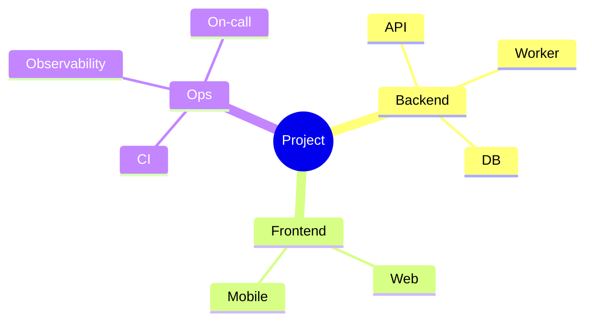
```mermaid
mindmap
    root((Project))
        Backend
            API
            Worker
            DB
        Frontend
            Web
            Mobile
        Ops
            CI
            Observability
            On-call
```

## Git Graph

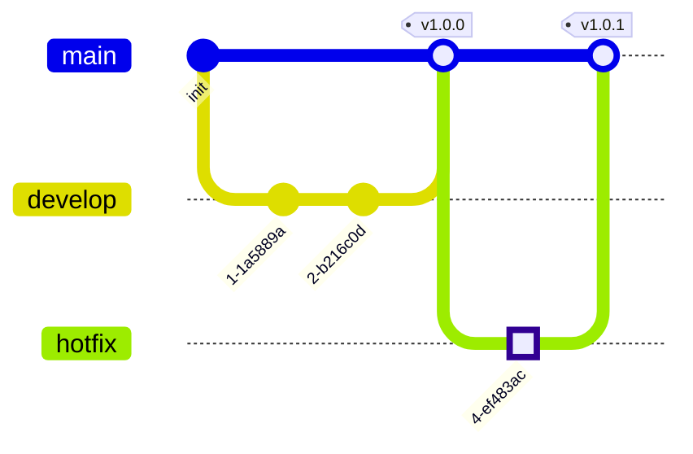
```mermaid
gitGraph
    commit id: "init"
    branch develop
    commit
    commit
    checkout main
    merge develop tag: "v1.0.0"
    branch hotfix
    commit type: HIGHLIGHT
    checkout main
    merge hotfix tag: "v1.0.1"
```

## Requirement

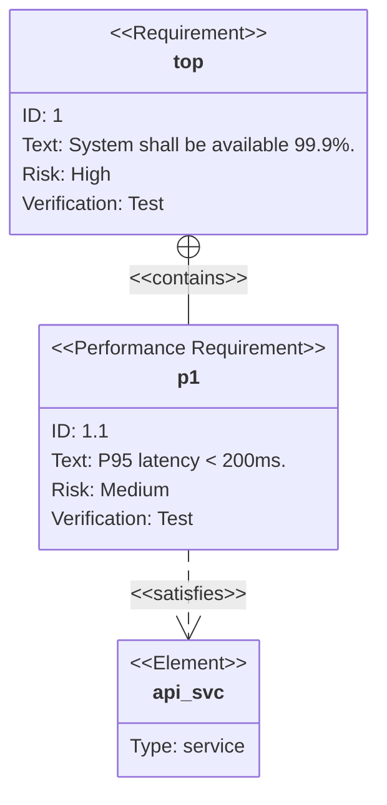
```mermaid
requirementDiagram

    requirement top {
        id: 1
        text: "System shall be available 99.9%."
        risk: high
        verifymethod: test
    }

    performanceRequirement p1 {
        id: 1.1
        text: "P95 latency < 200ms."
        risk: medium
        verifymethod: test
    }

    element api_svc {
        type: service
    }

    top - contains -> p1
    p1 - satisfies -> api_svc
```

## Block

```mermaid
block-beta
    columns 3
    db[(Database)]:3
    api["API"] cache[("Cache")] bucket[("Blob Storage")]
    web["Web App"] mobile["Mobile App"] worker["Worker"]
    api --> db
    api --> cache
    api --> bucket
    web --> api
    mobile --> api
    worker --> db
```

## Packet

```mermaid
packet-beta
    title IPv4 header
    0-3: "Version"
    4-7: "IHL"
    8-15: "Type of Service"
    16-31: "Total Length"
    32-47: "Identification"
    48-50: "Flags"
    51-63: "Fragment Offset"
    64-71: "TTL"
    72-79: "Protocol"
    80-95: "Header Checksum"
    96-127: "Source IP"
    128-159: "Destination IP"
```
