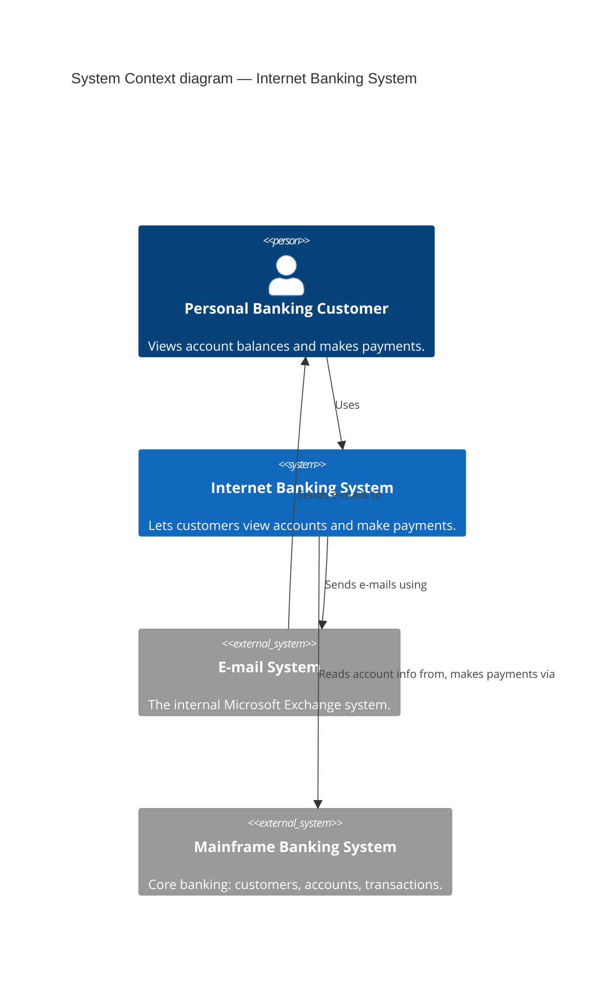
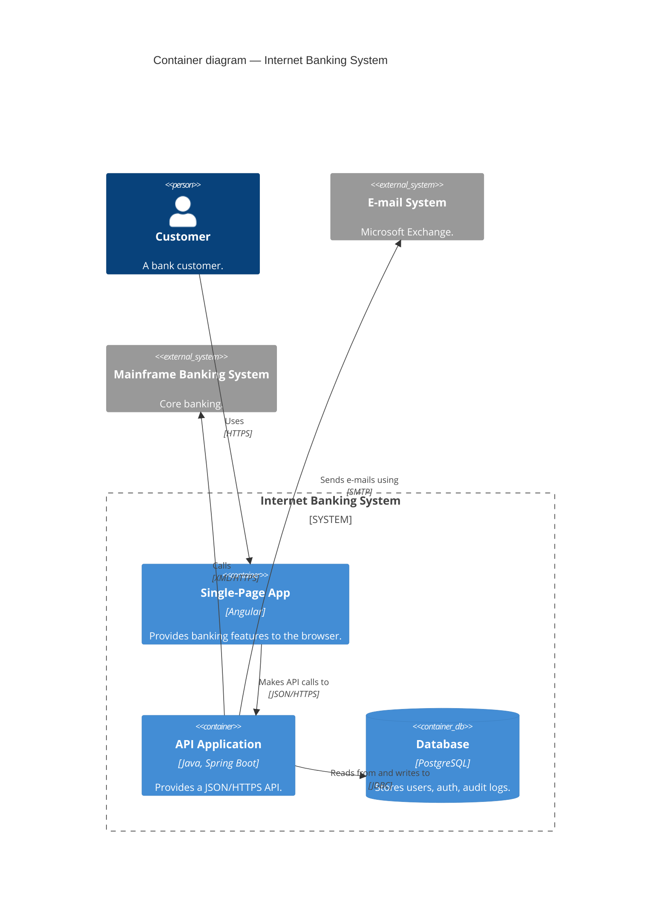
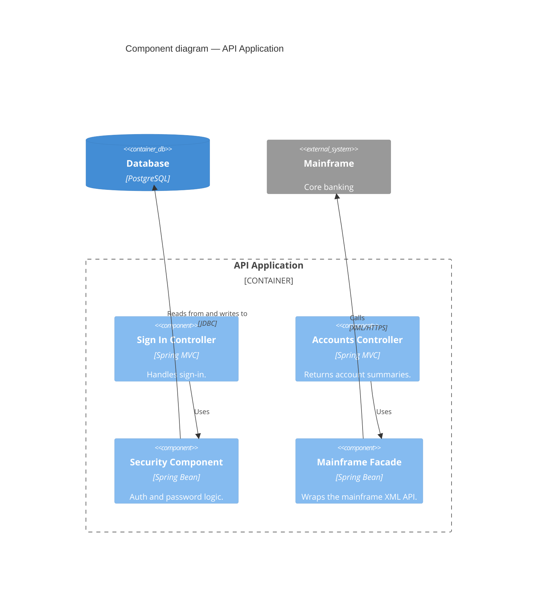
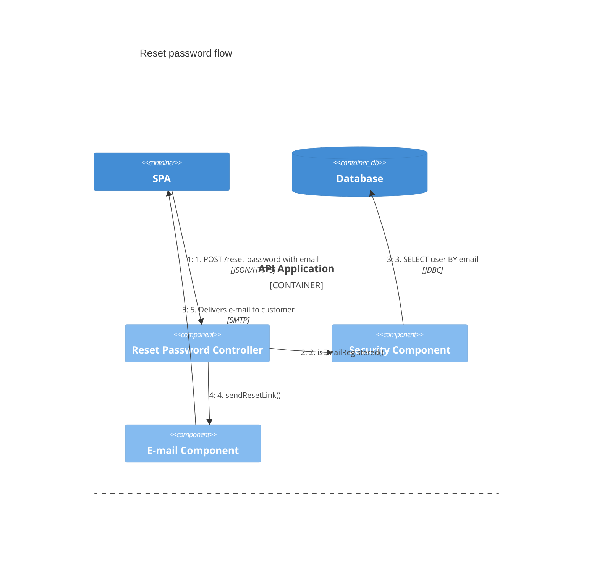
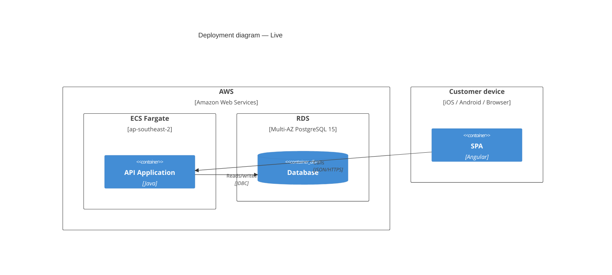

# C4 diagrams in Mermaid

Mermaid implements a subset of Simon Brown's C4 model with PlantUML-C4-compatible syntax. For the *modelling* side (which diagram to draw, what to put on it, how to extract from code) use the `c4` skill — this reference is only for the Mermaid rendering.

Marked **experimental** upstream; syntax may change. Layout is weaker than PlantUML C4; plan for that.

## Headers

- `C4Context` — System Context *and* System Landscape diagrams
- `C4Container` — Container diagrams
- `C4Component` — Component diagrams
- `C4Dynamic` — numbered interaction diagrams
- `C4Deployment` — infrastructure mapping

Followed optionally by `title <text>`.

## Elements

All elements accept trailing `?sprite, ?tags, $link` — but Mermaid ignores sprites/tags/links. Treat those as unsupported.

### People
```
Person(alias, "Label", "Description")
Person_Ext(alias, "External user", "…")
```

### Software systems (Context / Landscape)
```
System(alias, "Label", "Description")
System_Ext(alias, "External system", "…")
SystemDb(alias, "Label", "…")
SystemDb_Ext(alias, "External DB", "…")
SystemQueue(alias, "Label", "…")
SystemQueue_Ext(alias, "External queue", "…")
```

### Containers (Container diagrams)
```
Container(alias, "Label", "Technology", "Description")
Container_Ext(alias, "Label", "Tech", "…")
ContainerDb(alias, "Database", "PostgreSQL 15", "Stores users…")
ContainerDb_Ext(alias, "External DB", "Oracle 19c", "…")
ContainerQueue(alias, "Queue", "RabbitMQ", "…")
ContainerQueue_Ext(alias, "Topic", "Kafka", "…")
```

### Components (Component diagrams)
```
Component(alias, "Label", "Technology", "Description")
Component_Ext(alias, "Label", "Tech", "…")
ComponentDb(alias, "Label", "Tech", "…")
ComponentDb_Ext(alias, "Label", "Tech", "…")
ComponentQueue(alias, "Label", "Tech", "…")
ComponentQueue_Ext(alias, "Label", "Tech", "…")
```

### Deployment
```
Deployment_Node(alias, "Name", "Type", "Description") {
    Container(app, "App", "Java")
}
Node(alias, "Name", "Type")
Node_L(alias, "Name")   # layout hint: left
Node_R(alias, "Name")   # layout hint: right
```

Deployment nodes nest — a region contains VPCs contains servers contains runtimes contains containers.

### Boundaries
```
System_Boundary(alias, "Label") {
    Container(…)
    Container(…)
}

Container_Boundary(alias, "Label") {
    Component(…)
}

Enterprise_Boundary(alias, "Label") {
    System(…)
}

Boundary(alias, "Label", "type")   %% generic
```

Opening brace must be on the same line.

## Relationships

Signature: `Rel*(from, to, "label", "techn", "descr")`.

- `Rel(from, to, "…")` — default arrow
- `Rel_U` / `Rel_D` / `Rel_L` / `Rel_R` — directional hint
- `Rel_Back(from, to, "…")` — reverse arrowhead
- `BiRel(from, to, "…")` — bidirectional

With technology:
```
Rel(api, db, "Reads from and writes to", "JDBC")
Rel(spa, api, "Makes API calls to", "JSON/HTTPS")
```

## Styling

```
UpdateElementStyle(alias, $bgColor="#1971c2", $fontColor="#ffffff", $borderColor="#0d419d")
UpdateRelStyle(from, to, $textColor="#444", $lineColor="#888", $offsetX="-40", $offsetY="20")
UpdateLayoutConfig($c4ShapeInRow="3", $c4BoundaryInRow="2")
```

- `offsetX`/`offsetY` nudge the text label off the line midpoint — essential when labels overlap.
- Default layout: 4 shapes per row, 2 boundaries per row.
- Named params use `$prefix="value"` — prefer named over positional; positional works but is fragile.

## Unsupported vs PlantUML C4

| PlantUML C4 feature | Mermaid status |
|---|---|
| `Lay_U / Lay_D / Lay_L / Lay_R` layout-only stmts | **not supported** — use directional `Rel_*` and statement order |
| Sprites (icons on elements) | syntax parsed, not rendered |
| Tags and custom tag styling | parsed, not rendered |
| `$link` (click-through URLs) | parsed, not rendered |
| CSS / multi-skin theming | limited; use `UpdateElementStyle` |
| Custom legend entries | auto-only |

## Complete diagrams — minima

### System Context



### Container



### Component



### Dynamic



### Deployment



## Gotchas

- **Mermaid C4 is layout-fragile.** Order your element declarations roughly the way you want them laid out.
- **Use `UpdateRelStyle(…, $offsetY=…)`** when two labels overlap — no automatic collision avoidance.
- **`System_Boundary` must open its block on the same line as `{`.** `{` on the next line parses as a syntax error.
- **Don't forget `techn`** on Container/Component — it's the third positional argument, easy to accidentally put a description there instead.
