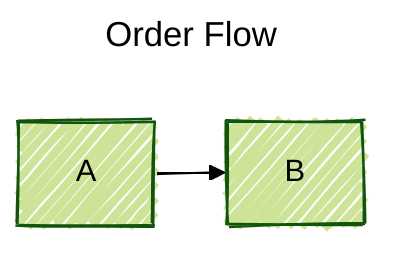
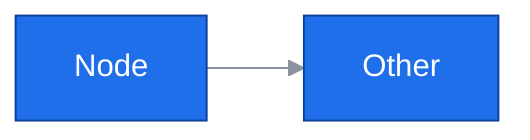
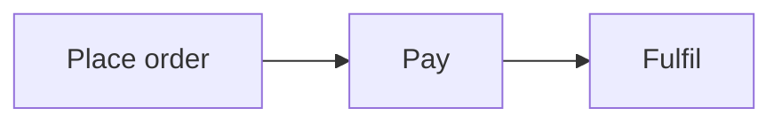

# Core syntax — shared across all Mermaid diagrams

## Fenced block

Always use the `mermaid` language tag:

    ```mermaid
    flowchart LR
        A --> B
    ```

Without the tag, renderers will show the source as plain code. Tag is case-insensitive but always lowercase it for consistency.

## Frontmatter config (preferred)

Since v10.5.0 the `%%{init: …}%%` directive is deprecated. Use frontmatter YAML at the top of the block:



Frontmatter is delimited by `---` lines. `title` renders above the diagram. `config` keys:

- **Top-level**: `theme`, `look`, `layout`, `fontFamily`, `logLevel`, `securityLevel`, `startOnLoad`.
- **Diagram-specific**: nest under `flowchart`, `sequence`, `class`, `state`, `gantt`, `c4`, etc.

### Legacy directive (still parsed)

```
%%{init: {"theme": "dark", "flowchart": {"curve": "linear"}}}%%
flowchart LR
    A --> B
```

Use only when the target renderer is pinned to pre-10.5.

## Themes

Built-in themes:

| Theme | Use |
|---|---|
| `default` | general purpose, colourful |
| `base` | the only theme that respects `themeVariables` |
| `dark` | dark-mode pages |
| `forest` | green palette, calm |
| `neutral` | black/white printing |

Site-wide (JS): `mermaid.initialize({ theme: 'base' })`.

Per-diagram (frontmatter): see example above.

### Custom theme variables (base theme only)



**Colours must be hex** (`#1f6feb`), not names (`blue`). Mermaid's theme engine silently ignores names.

Commonly-used vars: `primaryColor`, `primaryTextColor`, `primaryBorderColor`, `secondaryColor`, `tertiaryColor`, `lineColor`, `textColor`, `background`, `mainBkg`, `nodeBorder`, `clusterBkg`, `clusterBorder`, `edgeLabelBackground`, `titleColor`, `noteBkgColor`, `noteTextColor`.

## Comments

`%% …` starts a comment and runs to end-of-line. Ignored by the parser.

```mermaid
flowchart LR
    %% This is a comment
    A --> B  %% inline also works
```

## Escaping and special characters

- **Quote labels with punctuation**: any label containing `( ) [ ] { } , : ; " #` or starting with a number/reserved word should be wrapped in `"…"`.
- **Literal double-quote inside label**: use `&quot;`.
- **Literal `#`**: use `&#35;` (because `#` starts a style property).
- **Literal `;`**: use `&#59;` (because `;` is a statement separator in some diagrams).
- **HTML entities are honoured**: `&amp;`, `&lt;`, `&gt;`, `&copy;`, `&bull;`, etc.
- **Newlines in labels**: `\n` in a quoted string, or `<br>` in most diagrams (flowchart, sequence, class, state).
- **Markdown in labels** (v10+ with `markdownAutoWrap`): wrap in backticks inside quotes:
  ```
  A["`**Bold** and *italic*`"]
  ```

## Reserved words

Avoid using these as bare node IDs or participant names — either quote them or capitalise:

`end`, `subgraph`, `class`, `classDef`, `style`, `state`, `note`, `link`, `click`, `direction`, `title`, `accDescr`, `accTitle`, `actor`, `participant`, `loop`, `alt`, `else`, `opt`, `par`, `and`, `rect`, `activate`, `deactivate`.

Example fix: `end` as a node → use `End` or `"end"`.

## Accessibility

All diagrams support accessible titles and descriptions:



Renderers surface these as `<title>` and `<desc>` on the SVG, used by screen readers.

## Line length and formatting

- One statement per line. Semicolons sometimes work as separators but are inconsistent; avoid.
- Indentation does not matter to the parser for most diagrams (flowchart, sequence, class, state, er, c4). Use it for readability.
- Exceptions: `mindmap`, `kanban`, `block-beta`, `architecture-beta` — these ARE whitespace-sensitive. Details in each diagram's reference.

## Config reference highlights

```
config:
  theme: forest
  look: neo | classic | handDrawn
  layout: dagre | elk | fixed
  fontFamily: "trebuchet ms, Verdana, Arial"
  fontSize: 16
  maxTextSize: 90000
  maxEdges: 500
  securityLevel: strict | loose | antiscript | sandbox
  flowchart:
    htmlLabels: true
    curve: basis | linear | cardinal | stepAfter | …
    nodeSpacing: 50
    rankSpacing: 50
    useMaxWidth: true
    defaultRenderer: dagre-d3 | dagre-wrapper | elk
  sequence:
    diagramMarginX: 50
    diagramMarginY: 10
    actorMargin: 50
    width: 150
    height: 65
    boxMargin: 10
    mirrorActors: true
    bottomMarginAdj: 1
    useMaxWidth: true
    rightAngles: false
    showSequenceNumbers: false
```
