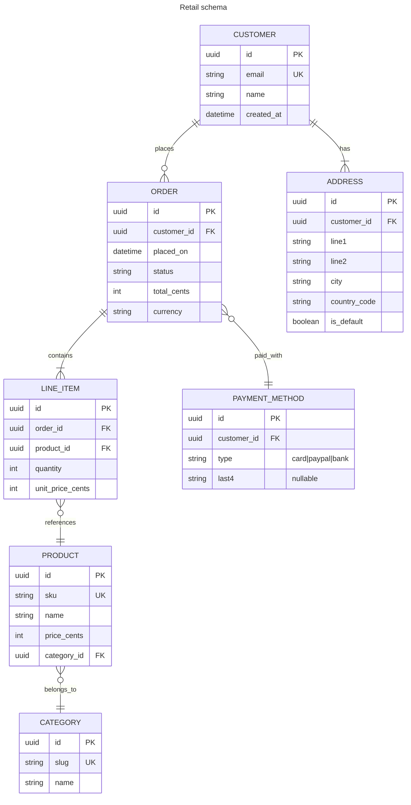

# Entity-relationship diagram

Use for database schemas and domain entity models with cardinality.

## Header

```
erDiagram
```

## Entities

Just a name, uppercase by convention:
```
erDiagram
    CUSTOMER
    ORDER
```

### Attributes block

```
erDiagram
    CUSTOMER {
        int id PK
        string email UK
        string name
        datetime created_at
    }
```

Format per attribute line: `type name [key-markers] ["comment"]`.

**Key markers**:
- `PK` — primary key
- `FK` — foreign key
- `UK` — unique key
- Multiple: comma-separated (`PK, FK`)

**Comment** (optional): double-quoted trailing string.

```
ORDER {
    int id PK "serial"
    int customer_id FK "references CUSTOMER.id"
    decimal total "in minor units (cents)"
    string status "pending|paid|shipped|cancelled"
}
```

## Relationships

Format: `ENTITY1 <left-cardinality><line><right-cardinality> ENTITY2 : label`

### Cardinality glyphs

Each side of the line has two characters that together form the crow's-foot notation:

| Left side | Right side | Meaning |
|---|---|---|
| `|o` | `o|` | zero or one |
| `||` | `||` | exactly one |
| `}o` | `o{` | zero or more (many) |
| `}|` | `|{` | one or more (many) |

### Line types

- `--` solid — **identifying** (child entity depends on parent for identity)
- `..` dotted — **non-identifying** (FK nullable / optional)

### Examples

```
CUSTOMER ||--o{ ORDER : places
```
→ Customer (exactly one) has zero-or-more Orders; identifying.

```
USER }o--|| DEPARTMENT : belongs_to
```
→ Many (zero+) Users belong to exactly one Department.

```
POST ||..o| IMAGE : has_hero
```
→ Post (one) has optional Image (zero or one); non-identifying.

### Aliases

`to` / `optionally to` keywords are aliases for `--` / `..`:

```
CUSTOMER one to zero or more ORDER : places
```

Same meaning as `CUSTOMER ||--o{ ORDER : places`.

## Comments

```
%% Legacy table, to be deprecated
erDiagram
    …
```

## Styling

Limited. Themes apply via frontmatter; per-entity styling is not supported at time of writing.

```
---
config:
  theme: base
  themeVariables:
    primaryColor: '#e7f5ff'
    primaryBorderColor: '#1971c2'
    lineColor: '#495057'
---
erDiagram
    …
```

## Full example



## Gotchas

- **Entity names are uppercase** by convention; the renderer doesn't force it, but lowercase looks odd alongside the standard notation.
- **Identifying vs non-identifying** affects line style (solid vs dashed). Pick based on whether the child's identity depends on the parent — most FK relationships are non-identifying (dotted).
- **Cardinality glyphs are picky**: `|{` is one-or-more from the right, `}|` is one-or-more from the left. If the crow's-feet face the wrong way, swap the glyph.
- **Types are free-text**. Mermaid doesn't validate `int` vs `uuid`. Use whatever matches your target DBMS or domain convention.
- **Labels on the relationship** use `:` after the entity pair — no `|pipes|`.
