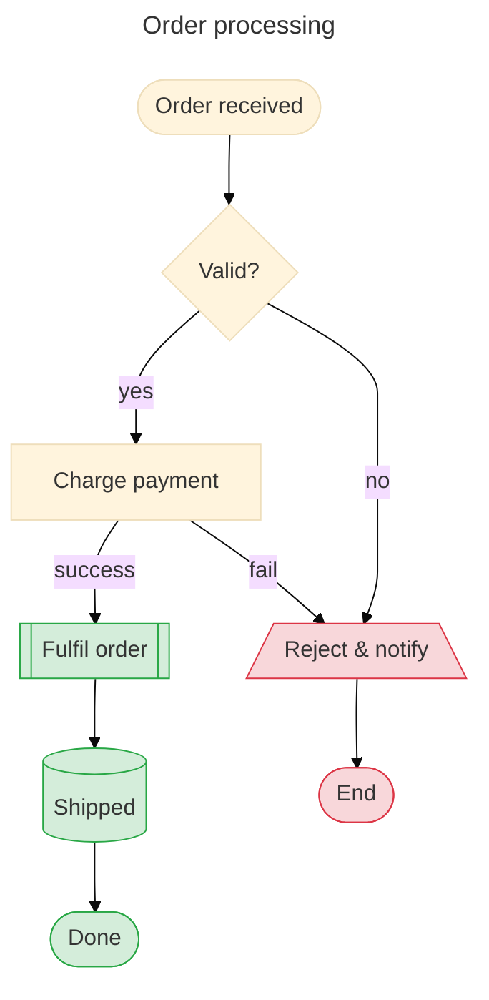

# Flowchart

Use for process / decision / data flow. The Mermaid workhorse.

## Header

```
flowchart TD         # Top → Down (default)
flowchart TB         # Top → Bottom (alias of TD)
flowchart BT         # Bottom → Top
flowchart LR         # Left → Right
flowchart RL         # Right → Left
```

`graph TD` / `graph LR` also parses but is the older keyword. Prefer `flowchart` — some features only work under it.

## Nodes

Every node has an **ID** (unique, alphanumeric+underscore/dash) and optional **text** in shape-determining brackets.

### Classic shape sigils

| Shape | Syntax | Example |
|---|---|---|
| Rectangle (default) | `id[text]` | `a[Process]` |
| Rounded | `id(text)` | `a(Rounded)` |
| Stadium / pill | `id([text])` | `a([Terminal])` |
| Subroutine | `id[[text]]` | `a[[Subroutine]]` |
| Cylinder (DB) | `id[(text)]` | `a[(Database)]` |
| Circle | `id((text))` | `a((Start))` |
| Asymmetric | `id>text]` | `a>Flag]` |
| Diamond | `id{text}` | `a{Decision?}` |
| Hexagon | `id{{text}}` | `a{{Prepare}}` |
| Parallelogram | `id[/text/]` | `a[/Input/]` |
| Parallelogram alt | `id[\text\]` | `a[\Output\]` |
| Trapezoid | `id[/text\]` | `a[/Priority\]` |
| Trapezoid alt | `id[\text/]` | `a[\Escalate/]` |
| Double circle | `id(((text)))` | `a(((End)))` |

### v11.3+ named shapes

```
A@{ shape: rect, label: "Process" }
B@{ shape: circle, label: "Start" }
C@{ shape: diam, label: "Decision" }
D@{ shape: cyl, label: "Database" }
E@{ shape: doc, label: "Document" }
F@{ shape: cloud, label: "External" }
```

Common names: `rect`, `circle`, `diam`, `hex`, `stadium`, `cyl`, `trap-t`, `trap-b`, `lin-rect` (lined rectangle), `doc`, `docs` (stacked docs), `win-pane`, `fork`, `flag`, `bolt`, `cloud`, `brace`, `brace-r`, `braces`, `rect-rounded`, `sm-circ` (small circle/start), `odd` (odd shape / comment), `text`.

### Icon shapes (v11.7+)

```
A@{ shape: icon, icon: "fa-user", form: "circle", label: "Customer", pos: "t", h: 48 }
```

Params: `icon` (FontAwesome or iconify name), `form` (`square`/`circle`/`rounded`), `label`, `pos` (`t`/`b`), `h` (height px).

### Image shapes

```
A@{ img: "https://example.com/logo.png", label: "Acme", pos: "t", w: 60, h: 60, constraint: "off" }
```

## Edges

Basic:

| Syntax | Meaning |
|---|---|
| `A --> B` | arrow |
| `A --- B` | open line (no arrow) |
| `A -.-> B` | dotted arrow |
| `A -.- B` | dotted line |
| `A ==> B` | thick arrow |
| `A === B` | thick line |
| `A ~~~ B` | invisible (use for layout hints) |
| `A <--> B` | bidirectional |
| `A o--o B` | circle both ends |
| `A x--x B` | cross both ends |
| `A ---o B` | circle end |
| `A ---x B` | cross end |

**Length** — extra dashes stretch the edge across ranks:
```
A --- B           # 1 rank
A ---- B          # 2 ranks
A ----- B         # 3 ranks
```
Same extension works for `===`, `-.-`, etc.

**Labels** — two equivalent forms:
```
A -->|label text| B
A -- label text --> B
```

Labels containing special characters should be wrapped in double quotes:
```
A -->|"Yes, proceed"| B
```

### Multi-target / chaining

```
A --> B & C --> D        # B and C both connect to D
A & B --> C              # A and B both connect to C
A --> B --> C --> D      # chain
```

### Edge IDs and animations (v11.10+)

```
flowchart LR
    e1@{ animate: true } A --> B
    e2@{ animation: fast } A --> C
```

Shorthand:
```
e1@fast-->B
e2@slow-->B
```

Animation values: `fast`, `slow`, `true`/`false` (stop).

## Subgraphs

```
flowchart TB
    subgraph sg_id [Display Title]
        direction LR
        A --> B
    end
    sg_id --> C
```

Notes:
- Subgraph IDs are referenceable like nodes (`sg_id --> C`).
- `direction LR` inside overrides the parent for that subgraph — but if a node inside connects to a node *outside*, the parent direction takes over.
- Nested subgraphs are supported.

## Styling

**Per-node inline:**
```
style A fill:#f9f,stroke:#333,stroke-width:4px,color:#fff
```

**Class-based (preferred for repeated styling):**
```
classDef important fill:#f96,stroke:#333,stroke-width:2px
classDef muted fill:#eee,stroke:#999,color:#666

class A,B important
class C muted

%% shorthand
D:::important --> E:::muted
```

**Default class** — applies to all nodes not explicitly classed:
```
classDef default fill:#fafafa,stroke:#bbb
```

**Link styling** — by index (0-based, order of declaration):
```
linkStyle 0 stroke:#f66,stroke-width:2px
linkStyle 1,3 stroke:#6c6,stroke-dasharray:5 5
linkStyle default stroke:#888
```

**Edge curve** — per-diagram (frontmatter `config.flowchart.curve`) or per-edge (v11.10+):
```
e1@A --> B
e1@{ curve: cardinal }
```

Curve values: `basis`, `bumpX`, `bumpY`, `cardinal`, `catmullRom`, `linear`, `monotoneX`, `monotoneY`, `natural`, `step`, `stepAfter`, `stepBefore`.

## Interaction

```
click A callback "Tooltip"
click B call myFunction() "Tooltip"
click C href "https://example.com" "Link text"
click D href "https://example.com" _blank
```

Targets: `_self`, `_blank`, `_parent`, `_top`. Click events require `securityLevel: loose`.

## Icons (FontAwesome)

```
A["fa:fa-twitter Tweet"]           # inline FontAwesome
B["fa:fa-ban forbidden"]
C("fab:fa-github GitHub")          # brand icon (fab namespace)
```

Requires the FontAwesome kit to be available to the renderer.

## Markdown in labels

Enable by wrapping in backticks inside quotes:
```
A["`**Bold header**
regular text
*italic*`"]
```

Auto-wrap controlled by `config.markdownAutoWrap` (default true).

## Common gotchas

- **`end` as a node ID** — parser interprets it as `end` of a subgraph. Use `End` or `"end"`.
- **Edge-like characters in labels** — `-->` inside a quoted label is fine; outside of quotes it starts an edge. Always quote text with arrows.
- **Spaces in IDs** — not allowed. Use `snake_case` or `kebab-case` IDs and put the display text in brackets.
- **Node must be declared before use in a class directive** — if you write `class A foo` before ever referencing `A`, it silently ignores the style.
- **Renderer differences** — GitHub uses `dagre` by default; `elk` is available via `config.layout: elk` but GitHub may fall back. Verify in the target environment.

## Full example


