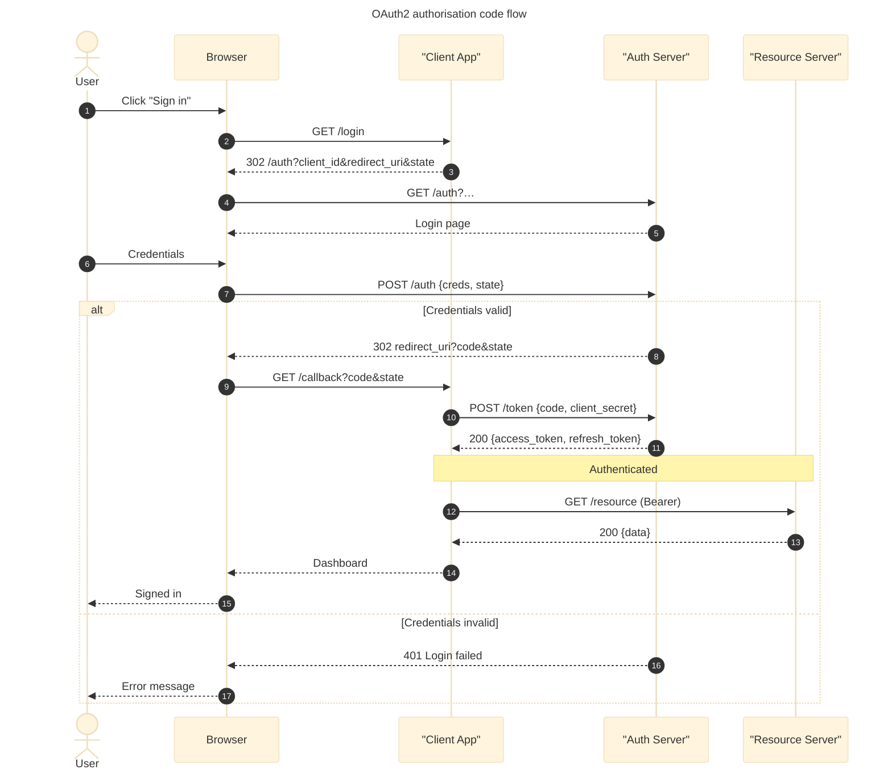

# Sequence diagram

Use for interactions between actors/services over time (API call flows, auth flows, event choreography).

## Header

```
sequenceDiagram
```

No direction parameter — sequence diagrams always flow top-to-bottom by time, left-to-right by participant.

## Participants and actors

Order matters: participants render left-to-right in the order they first appear. Declare explicitly to control order:

```
sequenceDiagram
    participant U as User
    participant W as Web
    participant A as API
    participant D as Database
```

Specialised participant kinds (v10.7.0+):

```
actor User
participant Web
boundary UI
control AuthController
entity Account
database UserDB
collections Events
queue Orders
```

### Aliasing

```
participant A as Alice
actor B as Bob
```

`A` is the internal ID used in arrows; `Alice` is what's displayed.

### Create / destroy (v10.3+)

```
sequenceDiagram
    A->>B: Hello
    create participant C
    B->>C: spin up
    destroy C
    C-->>B: goodbye
```

Only a *recipient* of an arrow can be `create`d; either party can be `destroy`ed.

### Grouping participants

```
box rgb(235,245,255) Front end
    participant U as User
    participant W as Web
end
box LightGreen Back end
    participant A as API
    participant D as DB
end
```

Color accepts named, hex, `rgb()`, `rgba()`, or `transparent`.

## Messages

| Arrow | Meaning |
|---|---|
| `A->B` | solid line, no arrowhead |
| `A-->B` | dashed line, no arrowhead |
| `A->>B` | solid with arrowhead (request) |
| `A-->>B` | dashed with arrowhead (response) |
| `A-xB` | solid with cross (failed/lost) |
| `A--xB` | dashed with cross |
| `A-)B` | solid open arrow (async, v8.6+) |
| `A--)B` | dashed open arrow (async reply) |
| `A<<->>B` | bidirectional (v11.0+) |
| `A<<-->>B` | bidirectional dashed |

Half-arrows (v11.12.3+) for more nuanced signals: `-|\`, `-|/`, `/|-`, `\-`, `-\`, `-//`, `//-`, and the dashed `--` variants.

### Activation (lifelines)

Explicit:
```
activate B
B-->>A: response
deactivate B
```

Shorthand — append `+`/`-` to arrows:
```
A->>+B: do the thing
B-->>-A: result
```

Activations stack; one `deactivate` pops one level.

### Notes

```
Note left of A: Thinking…
Note right of B: Has cache
Note over A,B: Both participants know
```

Multi-line notes use `<br>` or a literal newline inside quotes.

### Comments

```
%% This is a comment and renders nothing
```

## Control structures

```
loop Every 10s
    A->>B: poll
    B-->>A: state
end
```

```
alt is valid
    A->>B: proceed
else invalid
    A-->>A: reject
else timeout
    A->>C: escalate
end
```

```
opt In debug mode
    A->>Log: details
end
```

```
par Charge card
    A->>Stripe: /charge
and Reserve inventory
    A->>Inventory: /reserve
and Notify email
    A->>Mailer: /queue
end
```

```
critical Establish connection
    A->>DB: connect
option Network failure
    A->>Retry: back off
option DB down
    A->>Fallback: read replica
end
```

```
break Session expired
    A-->>User: redirect to login
end
```

### Highlight regions

```
rect rgb(255, 243, 224)
    A->>B: inside the highlight
    B-->>A: response
end
```

## Autonumber

```
sequenceDiagram
    autonumber
    A->>B: step one
    B->>C: step two
```

Or with formatting:
```
autonumber 10 10           # start=10, step=10
autonumber "<b>[%d]</b>"   # custom format string
```

## Links (actor menus)

```
link Alice: Dashboard @ https://dash.example.com
link Alice: Wiki @ https://wiki.example.com
links Bob: {"Dashboard": "https://dash.example.com", "Wiki": "https://wiki.example.com"}
```

Renders a popup menu when clicking an actor. Requires `securityLevel: loose`.

## Styling

Set in frontmatter:
```
---
config:
  theme: base
  themeVariables:
    actorBkg: "#e7f5ff"
    actorBorder: "#1971c2"
    actorTextColor: "#0b3b75"
    signalColor: "#444"
    signalTextColor: "#222"
    noteBkgColor: "#fff3bf"
    noteTextColor: "#594b00"
---
sequenceDiagram
    …
```

## Full example



## Gotchas

- **Participants in arrows must exist.** Either via explicit `participant`/`actor` or by appearing in a prior message. Order-of-first-appearance determines layout.
- **Names with spaces/punctuation** must be aliased: `participant Stripe as "Stripe API"`.
- **`-)` is async** — don't confuse with `->>`. Async arrows convey "fire and forget".
- **`activate`/`deactivate` stack** — unbalanced calls produce misaligned lifelines.
- **`rect` inside `alt`/`loop`** — supported but be careful with nesting depth; deep nesting collapses readability.
