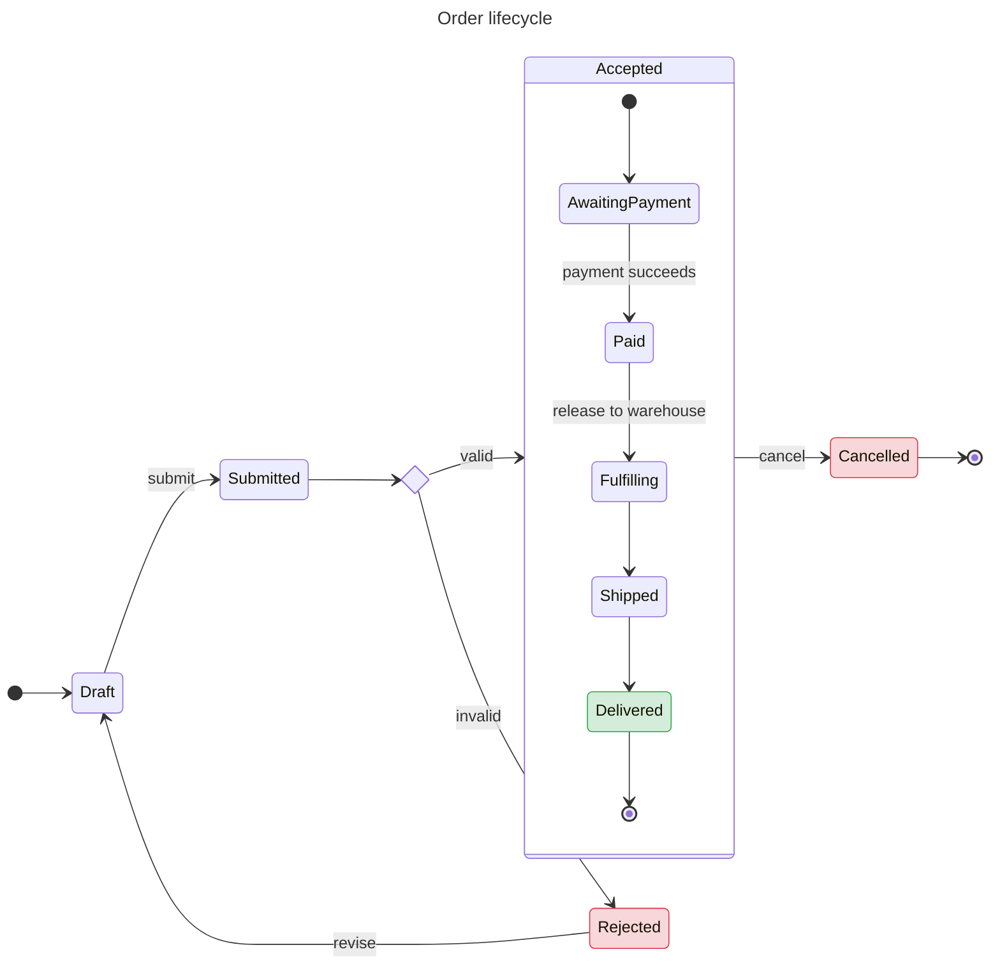

# State diagram

Use for state machines, lifecycles, workflows with discrete states.

## Header

Prefer v2 — richer features, better rendering:
```
stateDiagram-v2
```

Legacy:
```
stateDiagram
```

## States

### Simple declaration

```
stateDiagram-v2
    Idle
    Running
    Stopped
```

### Descriptions

Two equivalent forms:

```
stateDiagram-v2
    state "Waiting for input" as Waiting
    state "Processing request" as Processing
```

Or the colon shortcut:
```
stateDiagram-v2
    Waiting : Waiting for input
    Processing : Processing request
```

### Start and end

`[*]` is both start and end, context-sensitive:
```
stateDiagram-v2
    [*] --> Idle
    Idle --> Running
    Running --> [*]
```

## Transitions

Arrow + optional label:
```
State1 --> State2 : event / action
Idle --> Running : start
Running --> Idle : stop [after 10s]
```

## Composite states

Nested with `{ … }`:
```
stateDiagram-v2
    [*] --> On
    state On {
        [*] --> Idle
        Idle --> Working : click
        Working --> Idle : done
    }
    On --> Off : power off
    Off --> [*]
```

## Pseudo-states

### Choice (branching)

```
stateDiagram-v2
    state if_valid <<choice>>
    Submit --> if_valid
    if_valid --> Accepted : if valid
    if_valid --> Rejected : if invalid
```

### Fork / Join (parallel)

```
stateDiagram-v2
    state fork <<fork>>
    state join <<join>>

    [*] --> fork
    fork --> Work1
    fork --> Work2
    Work1 --> join
    Work2 --> join
    join --> [*]
```

### Concurrent regions

Use `--` inside a composite to separate regions that run in parallel:

```
stateDiagram-v2
    state Order {
        [*] --> Pending

        Pending --> Paid
        Paid --> Shipped
        Shipped --> [*]
        --
        [*] --> ItemReserved
        ItemReserved --> ItemPacked
        ItemPacked --> [*]
    }
```

## Notes

```
stateDiagram-v2
    Processing : Processing
    note left of Processing
        May retry up to 3 times
        before escalating.
    end note
    note right of Processing : Also logs to audit
```

## Direction

```
stateDiagram-v2
    direction LR
    A --> B
```

Values: `LR`, `TB`, `RL`, `BT`. Default TB for stateDiagram-v2.

## Styling

```
stateDiagram-v2
    classDef good fill:#d4edda,stroke:#28a745
    classDef bad fill:#f8d7da,stroke:#dc3545

    Accepted:::good
    Rejected:::bad

    Submit --> Accepted
    Submit --> Rejected
```

**Limitation**: styling does not apply to `[*]` start/end markers nor (reliably) to composite state boundaries.

## Full example



## Gotchas

- **Use `stateDiagram-v2`**. v1 lacks composite-state rendering quality and some of the pseudo-state syntax.
- **`[*]` vs named end**: `[*]` is both start and terminal. If you need multiple distinct end states, give them names and route arrows accordingly.
- **`--` as region separator** only inside a composite state (between `state X { … }`). Outside a composite it's a transition operator.
- **Concurrent regions are visual** — Mermaid does not simulate them; they document intent.
- **Labels with `/`**: use `event / action` style by convention (UML). Just text to Mermaid.
